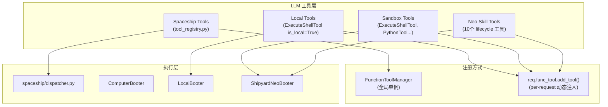
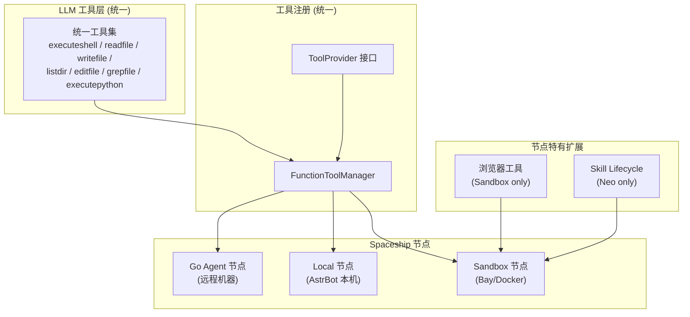

# Computer Use 解耦 — 统一为 Spaceship 节点

## 现状分析

### 三种运行时

| 运行时 | 后端实现 | 工具注册方式 | 执行位置 |
|--------|----------|-------------|---------|
| `local` | `LocalBooter` (subprocess) | 硬编码 `astr_main_agent.py` L278-L283 | AstrBot 本机 |
| `sandbox` (Neo) | `ShipyardNeoBooter` (Bay API) | 硬编码 `astr_main_agent.py` L861-L915 | 远程 Bay sandbox |
| `spaceship` | Go agent (WebSocket) | `FunctionToolManager.add_func()` | 远程节点 |

### 当前架构图



### 工具能力对照

| 能力 | Spaceship (Go) | Local (`LocalBooter`) | Sandbox (Neo) |
|------|---------------|-----------------------|---------------|
| Shell 执行 | `executeshell` | `astrbot_execute_shell` | `astrbot_execute_shell` |
| Python 执行 | ❌ | `astrbot_execute_python` | `astrbot_execute_ipython` |
| 读文件 | `readfile` | ❌ (通过 shell) | ❌ (通过 shell) |
| 写文件 | `writefile` | ❌ (通过 shell) | ❌ (通过 shell) |
| 列目录 | `listdir` | ❌ (通过 shell) | ❌ (通过 shell) |
| 编辑文件 | `editfile` | ❌ | ❌ |
| Grep 搜索 | `grepfile` | ❌ | ❌ |
| 文件上传 | ❌ | ❌ | `astrbot_upload_file` |
| 文件下载 | ❌ | ❌ | `astrbot_download_file` |
| 浏览器自动化 | ❌ | ❌ | `astrbot_execute_browser` 等 |
| Skill lifecycle | ❌ | ❌ | 10 个 Neo 专属工具 |

### 耦合点

1. **`astr_main_agent.py`** 硬编码了 20+ 个工具的 import 和注入逻辑（L22-L51, L278-L283, L861-L915）
2. **`astr_main_agent_resources.py`** 模块级实例化所有工具对象（L460-L479）
3. 工具的 `call()` 方法直接依赖 `AstrAgentContext` → `get_booter()` → 具体 Booter 实现
4. Local 和 Sandbox 的 shell 工具实际上是**同一个类**（`ExecuteShellTool`），靠 `is_local` flag 切换

## 解耦目标

> 让 local 和 sandbox 变成 Spaceship 节点，共享统一的工具注册机制

### 目标架构



## Proposed Changes

### Phase 1: ToolProvider 接口（解耦工具注册）

> 目标：`astr_main_agent.py` 不再直接 import 任何具体工具

#### [NEW] `astrbot/core/tool_provider.py`

定义 `ToolProvider` 协议：

```python
class ToolProvider(Protocol):
    def get_tools(self, session_context: SessionContext) -> list[FunctionTool]:
        """返回该 session 可用的工具列表"""
        ...
    
    def get_system_prompt_addon(self, session_context: SessionContext) -> str:
        """返回需要追加到 system prompt 的内容"""
        ...
```

#### [MODIFY] `astrbot/core/computer/` → 实现 `ComputerToolProvider`

```python
class ComputerToolProvider(ToolProvider):
    def get_tools(self, ctx):
        runtime = ctx.config.get("computer_use_runtime", "none")
        if runtime == "none":
            return []
        if runtime == "local":
            return [LOCAL_EXECUTE_SHELL_TOOL, LOCAL_PYTHON_TOOL]
        # sandbox
        tools = [EXECUTE_SHELL_TOOL, PYTHON_TOOL, FILE_UPLOAD_TOOL, ...]
        if self._has_browser(ctx):
            tools += [BROWSER_EXEC_TOOL, ...]
        if self._is_neo(ctx):
            tools += [NEO_SKILL_TOOLS...]
        return tools
```

#### [MODIFY] `astr_main_agent.py`

删掉所有工具 import 和硬编码注入，改为：

```python
for provider in tool_providers:
    tools = provider.get_tools(session_ctx)
    for tool in tools:
        req.func_tool.add_tool(tool)
    req.system_prompt += provider.get_system_prompt_addon(session_ctx)
```

---

### Phase 2: 统一工具协议（共享工具定义）

> 目标：Local / Sandbox / Go Agent 共享同一套 LLM 工具 schema

#### 共享工具清单

| 工具名 | 当前状态 | 统一后 |
|--------|---------|--------|
| `executeshell` | 3 套不同实现 | 统一 schema，ComputerBooter 路由到实际后端 |
| `executepython` | 仅 local/sandbox | 原样保留，Go agent 可后期扩展 |
| `readfile` | 仅 Spaceship | **提升为共享工具**，local/sandbox 也支持 |
| `writefile` | 仅 Spaceship | **提升为共享工具** |
| `listdir` | 仅 Spaceship | **提升为共享工具** |
| `editfile` | 仅 Spaceship | **提升为共享工具** |
| `grepfile` | 仅 Spaceship | **提升为共享工具** |

关键思路：Spaceship 现有的 `readfile`/`writefile`/`listdir`/`editfile`/`grepfile` 工具定义直接复用给 local 和 sandbox 后端。不需要通过 shell "间接" 实现文件操作了。

---

### Phase 3: Local/Sandbox 作为 Spaceship 节点

> 目标：Local 和 Sandbox 成为 Spaceship 的节点类型，共享 dispatcher + 工具注册

#### Local Node

将 `LocalBooter` 的 component 实现包装成一个 "内建" Spaceship 节点：

- 不走 WebSocket，使用 in-process 调用
- 复用 `dispatcher.py` 的任务调度 + chunk 拼接逻辑
- 注册到 `SpaceshipRuntime` 的节点列表中

#### Sandbox Node

将 `ShipyardNeoBooter` 包装成另一个 "内建" Spaceship 节点：

- 同样不走 WebSocket，in-process 调用 Bay API
- 通过 capability 声明支持的额外工具（browser, skill lifecycle）
- 节点级别声明 `granted_scopes`

#### 节点能力声明

```python
class NodeCapabilities:
    shell: bool = True
    python: bool = False
    filesystem: bool = True
    browser: bool = False
    skill_lifecycle: bool = False
```

工具注册时根据节点能力决定注册哪些工具：
- 所有节点：`executeshell`, `readfile`, `writefile`, `listdir`, `editfile`, `grepfile`
- `python=True`: + `executepython`
- `browser=True`: + `execute_browser`, `execute_browser_batch`, `run_browser_skill`
- `skill_lifecycle=True`: + 10 个 Neo skill 工具

## 实施优先级

> **建议分阶段做，Phase 1 最紧急也最独立，可以立即开始。**

| Phase | 改动范围 | 风险 | 收益 |
|-------|---------|------|------|
| **Phase 1**: ToolProvider 解耦 | 仅 Python 侧重构 | 低 — 纯内部重构 | 解除 agent ↔ computer 强耦合 |
| **Phase 2**: 统一工具 schema | Python + Go | 中 — 需要对齐协议 | 工具一致性，消除通过 shell 间接操作文件 |
| **Phase 3**: 节点化 | Python 侧架构变更 | 高 — 改变执行模型 | Local/Sandbox 成为 Spaceship 节点 |

## 关键文件参考

### 当前 Computer Use
- `astrbot/core/computer/olayer/` — Protocol 抽象层（ShellComponent, PythonComponent, FileSystemComponent, BrowserComponent）
- `astrbot/core/computer/booters/base.py` — ComputerBooter 基类
- `astrbot/core/computer/booters/local.py` — LocalBooter（subprocess 实现）
- `astrbot/core/computer/booters/shipyard_neo.py` — ShipyardNeoBooter（Bay API 实现）
- `astrbot/core/computer/tools/` — FunctionTool 子类（shell, python, fs, browser, neo_skills）
- `astrbot/core/computer/computer_client.py` — Booter 工厂 + sandbox session 管理
- `astrbot/core/astr_main_agent_resources.py` — 工具全局实例 + system prompt 常量
- `astrbot/core/astr_main_agent.py` — Agent builder，硬编码工具注入

### 当前 Spaceship
- `astrbot/core/spaceship/tool_registry.py` — FunctionToolManager 注册
- `astrbot/core/spaceship/dispatcher.py` — WebSocket 任务调度
- `astrbot/core/spaceship/runtime.py` — 运行时管理
- `Spaceship/agent/internal/executor/executor.go` — Go agent 任务路由
- `Spaceship/agent/internal/shell/shell.go` — Go agent shell 执行（含流式）
- `Spaceship/agent/internal/fileops/fileops.go` — Go agent 文件操作
